# Primus Extension Codebase Refactoring Plan

## Current Pain Points

- **6 files exceed 200 lines**, the largest being 882 lines
- Module-level mutable state scattered across files (e.g. `requestsMap`, `isReadyRequest`, `tabId`, `dappTabId` in pageDecode)
- Duplicate HTTP utilities: `[src/utils/request.ts](src/utils/request.ts)` vs `[src/pages/Background/utils/request.js](src/pages/Background/utils/request.js)`
- Hardcoded error tip maps and error codes inline in business logic
- Mixed concerns: message routing, state management, business logic, and UI all in single files
- Inconsistent use of TypeScript vs JavaScript

## Architecture Overview (Current vs Proposed)

```mermaid
graph LR
  subgraph current ["Current: Fat Monolithic Handlers"]
    BgIndex["Background/index.js\n201 lines"]
    PageDecode["pageDecode/index.js\n882 lines"]
    Algorithm["algorithm.js\n414 lines"]
    SDK["padoZKAttestationJSSDK/index.js\n534 lines"]
    DevConsole["devconsole/index.js\n256 lines"]
    ContentPD["content/pageDecode/index.jsx\n281 lines"]
  end

  subgraph proposed ["Proposed: Single-Responsibility Modules"]
    BgIndex2["Background/index.js\n~120 lines"]
    OffscreenMgr["offscreenManager.js\n~80 lines"]

    PDState["pageDecode/state.js\n~60 lines"]
    PDIntercept["pageDecode/requestInterceptor.js\n~150 lines"]
    PDTemplate["pageDecode/templateMatcher.js\n~120 lines"]
    PDMsg["pageDecode/messageHandler.js\n~180 lines"]
    PDSdkComm["pageDecode/sdkBridge.js\n~80 lines"]

    AlgRouter["algorithm/messageHandler.js\n~120 lines"]
    AlgErrors["algorithm/errorMap.js\n~100 lines"]
    AlgAttest["algorithm/attestationHandler.js\n~120 lines"]

    SDKInit["sdkAttestation/init.js\n~120 lines"]
    SDKAttest["sdkAttestation/attestation.js\n~150 lines"]
    SDKMsg["sdkAttestation/messageHandler.js\n~120 lines"]

    DCCapture["devconsole/requestCapture.js\n~100 lines"]
    DCTab["devconsole/tabManager.js\n~80 lines"]
    DCMsg["devconsole/messageHandler.js\n~80 lines"]

    CPDApp["content/pageDecode/App.jsx\n~100 lines"]
    CPDHooks["content/pageDecode/hooks.js\n~80 lines"]
    CPDEntry["content/pageDecode/index.jsx\n~80 lines"]
  end
```




---

## Refactoring Details by File

### 1. `src/pages/Background/pageDecode/index.js` (882 -> ~5 modules)

The most critical file. Contains request interception, template matching, SDK messaging, state management, and error handling all in one.

**Split into:**

- `**pageDecode/state.js`** (~60 lines) -- Centralized state management using a State class or factory:
  - `requestsMap`, `isReadyRequest`, `tabId`, `dappTabId`, `dataSourcePageTabId`, `currentTemplate`, etc.
  - `resetState()`, getters/setters
  - Replaces all scattered module-level `let`/`var` variables
- `**pageDecode/requestInterceptor.js`** (~150 lines) -- Web request capture logic:
  - `setupWebRequestListener(state)` -- attaches `chrome.webRequest.onBeforeRequest`
  - `checkSDKTargetRequestFn(details, state)` -- checks if request matches template
  - `checkWebRequestIsReadyFn(state)` -- checks if all required requests are captured
  - `removeWebRequestListener(state)` -- cleanup
- `**pageDecode/templateMatcher.js**` (~120 lines) -- Template matching and algorithm param assembly:
  - `formatAlgorithmParamsFn(state)` -- builds algorithm params from captured requests + template
  - Reuses existing `extraRequestFn2`, `extraRequestHtmlFn`, `checkResIsMatchConditionFn` from `utils.js`
- `**pageDecode/messageHandler.js**` (~180 lines) -- Main message dispatcher:
  - `pageDecodeMsgListener(message, sender, sendResponse)` -- thin dispatcher
  - `handleInit`, `handleInitCompleted`, `handleStart`, `handleClose`, `handleCancel`, `handleEnd`
  - Each handler is a small function that delegates to state/interceptor/templateMatcher
- `**pageDecode/sdkBridge.js**` (~80 lines) -- SDK/dapp communication:
  - `sendMsgToSdk(data)`, `sendMsgToDataSourcePage(data)`
  - `handlerForSdk(message)`, `eventReportGenerateFn()`

### 2. `src/pages/Background/algorithm.js` (414 -> 3 modules)

**Split into:**

- `**algorithm/errorMap.js`** (~100 lines) -- All error tip maps and error code constants:
  - `SDK_ERROR_TIPS`, `NETWORK_ERROR_TIPS`, `SUBSCRIPTION_ERROR_TIPS`
  - `getErrorTipByRetcode(retcode, context)` helper
  - Extract the 3 large hardcoded tip objects from the current `getAttestationResult` handler
- `**algorithm/attestationHandler.js`** (~120 lines) -- Attestation result processing:
  - `handleGetAttestation(message, state)` -- processes attestation result
  - `handleGetAttestationResult(message, state)` -- handles final result with error mapping
- `**algorithm/messageHandler.js**` (~120 lines) -- Message router:
  - `algorithmMsgListener(message, sender, sendResponse)` -- thin dispatcher
  - `handleStart(message)` -- init algorithm

### 3. `src/pages/Background/padoZKAttestationJSSDK/index.js` (534 -> 3 modules)

**Split into:**

- `**sdkAttestation/init.js`** (~120 lines) -- Initialization and config loading:
  - `handleInitAttestation(message, state)` -- fetches config, loads template, validates
  - Template building logic (request/response templates)
- `**sdkAttestation/attestation.js`** (~150 lines) -- Attestation lifecycle:
  - `handleStartAttestation(message, state)` -- starts the attestation flow
  - `handleGetAttestationResult(message, state)` -- result + timeout handling
  - Tab removal cleanup
- `**sdkAttestation/messageHandler.js**` (~120 lines) -- Message router:
  - `padoZKAttestationJSSDKMsgListener(message, sender, sendResponse)` -- thin dispatcher

### 4. `src/content/pageDecode/index.jsx` (281 -> 3 modules)

**Split into:**

- `**content/pageDecode/hooks.js`** (~80 lines) -- Custom hooks:
  - `useAttestationStatus()` -- manages `status`, `isReadyFetch`, `resultStatus`, `errorTxt`
  - `useMessageListener(status, setters)` -- handles `webRequestIsReady`, `end` messages
  - `useTimeoutManager(status, sendMessage)` -- handles `initialized` timeout, `interceptionFail`, `dataSourcePageDialogTimeout`
- `**content/pageDecode/App.jsx`** (~100 lines) -- Pure React component:
  - `PadoCard` component using the extracted hooks
  - Clean render with `HeaderEl`, `RightEl`, `FooterEl`
- `**content/pageDecode/index.jsx**` (~80 lines) -- Entry/bootstrap:
  - DOM injection (`#pado-extension-content`)
  - `createRoot` and render
  - Initial message listener for `append`

### 5. `src/pages/Background/devconsole/index.js` (256 -> 3 modules)

**Split into:**

- `**devconsole/requestCapture.js`** (~100 lines) -- Web request capture:
  - `setupRequestCapture(tabId)` -- `chrome.webRequest.onBeforeRequest` listener
  - `removeRequestCapture()` -- cleanup
- `**devconsole/tabManager.js`** (~80 lines) -- Tab lifecycle:
  - `createDataSourceTab(url)`, `closeDataSourceTab(tabId)`
  - `injectContentScripts(tabId)`
- `**devconsole/messageHandler.js**` (~80 lines) -- Message router:
  - `devconsoleMsgListener(message, sender, sendResponse)`

### 6. `src/pages/Background/index.js` (201 -> 2 modules)

**Split into:**

- `**Background/offscreenManager.js`** (~80 lines) -- Offscreen document lifecycle:
  - `hasOffscreenDocument()`, `createOffscreenDoc()`, `closeOffscreenDoc()`
  - `sendMessageToOffscreen(message)`
- `**Background/index.js`** (~120 lines) -- Entry point (slimmed):
  - `creatUserInfo()`, install/update handlers
  - `processAlgorithmReq()` using offscreenManager
  - Message routing to sub-handlers

### 7. `src/services/algorithms/offscreen.js` (203 -> modernized)

- Replace `var` with `const`/`let`
- Extract WASM wrapper into a class `AlgorithmClient` with methods: `init()`, `getAttestation()`, `getAttestationResult()`, `startOffline()`
- Keep message listener as thin dispatcher

---

## Cross-cutting Improvements

### Unify HTTP Utilities

Currently there are two fetch wrappers:

- `[src/utils/request.ts](src/utils/request.ts)` -- used by API services
- `[src/pages/Background/utils/request.js](src/pages/Background/utils/request.js)` -- used by background scripts

**Action:** Keep `src/utils/request.ts` as the single HTTP client. Adapt `customFetch2` in `Background/utils/request.js` to either reuse the shared client or remain as a lightweight `fetch` wrapper clearly scoped to background-only use cases (no auth headers). Add a comment explaining the distinction.

### Extract Error Constants

Create `src/config/errorCodes.js`:

- All error code constants (e.g. `'00013'` for target data missing)
- Error tip maps currently hardcoded in `algorithm.js`
- Reusable `getErrorMessage(code, context)` function

### Naming Cleanup

- Rename `chandleClose` -> `handleClose` (typo)
- Rename `creatUserInfo` -> `createUserInfo` (typo)
- Rename `extraRequestFn2` -> `fetchRequestData` (semantic)
- Rename `extraRequestHtmlFn` -> `fetchHtmlContent` (semantic)
- Rename `errorFn` -> `handleAttestationError` (semantic)
- Rename `checkResIsMatchConditionFn` -> `validateResponseCondition` (semantic)
- Apply consistent suffix removal (drop `Fn` suffix where redundant)

### State Management Pattern

For Background scripts with shared mutable state, introduce a simple state factory:

```javascript
function createPageDecodeState() {
  return {
    requestsMap: {},
    isReadyRequest: false,
    tabId: null,
    dappTabId: null,
    dataSourcePageTabId: null,
    currentTemplate: null,
    // ... other state
    reset() { /* reset all to defaults */ }
  };
}
```

This replaces scattered module-level variables and makes state explicit, testable, and resettable.

---

## Files NOT Changed

The following files are already small and well-structured -- no changes needed:

- `src/config/attestation.ts` (3 lines)
- `src/config/constants.ts` (9 lines)
- `src/services/api/*.ts` (9-21 lines each)
- `src/services/wallets/utils.js` (40 lines)
- `src/utils/utils.ts` (10 lines)
- `src/content/pageDecode/HeaderEl.jsx` (14 lines)
- `src/content/pageDecode/RightEl.jsx` (24 lines)
- `src/content/pageDecode/FooterEl.jsx` (84 lines)
- `src/pages/Background/utils/handleError.js` (16 lines)
- `src/pages/Background/utils/msgTransfer.js` (36 lines)
- `src/pages/Background/exData.js` (93 lines)
- `src/pages/Background/padoZKAttestationJSSDK/utils.js` (29 lines)

---

## Execution Order

The refactoring should proceed bottom-up to avoid breaking dependencies:

1. Cross-cutting: error constants, naming fixes, shared state pattern
2. `pageDecode/index.js` (882 lines) -- biggest impact, most complex
3. `padoZKAttestationJSSDK/index.js` (534 lines) -- similar pattern
4. `algorithm.js` (414 lines) -- depends on pageDecode changes
5. `content/pageDecode/index.jsx` (281 lines) -- independent content script
6. `devconsole/index.js` (256 lines) -- independent module
7. `Background/index.js` + `offscreen.js` -- entry points, touch last
8. `webpack.config.js` -- optional cleanup, lowest priority

